---
## Front matter
title: "Отчет по лабораторной работе №3"
subtitle: "Простейший вариант"
author: "Доберштейн Алина Сергеевна"

## Generic otions
lang: ru-RU
toc-title: "Содержание"

## Bibliography
bibliography: bib/cite.bib
csl: pandoc/csl/gost-r-7-0-5-2008-numeric.csl

## Pdf output format
toc: true # Table of contents
toc-depth: 2
lof: true # List of figures
lot: true # List of tables
fontsize: 12pt
linestretch: 1.5
papersize: a4
documentclass: scrreprt
## I18n polyglossia
polyglossia-lang:
  name: russian
  options:
	- spelling=modern
	- babelshorthands=true
polyglossia-otherlangs:
  name: english
## I18n babel
babel-lang: russian
babel-otherlangs: english
## Fonts
mainfont: PT Serif
romanfont: PT Serif
sansfont: PT Sans
monofont: PT Mono
mainfontoptions: Ligatures=TeX
romanfontoptions: Ligatures=TeX
sansfontoptions: Ligatures=TeX,Scale=MatchLowercase
monofontoptions: Scale=MatchLowercase,Scale=0.9
## Biblatex
biblatex: true
biblio-style: "gost-numeric"
biblatexoptions:
  - parentracker=true
  - backend=biber
  - hyperref=auto
  - language=auto
  - autolang=other*
  - citestyle=gost-numeric
## Pandoc-crossref LaTeX customization
figureTitle: "Рис."
tableTitle: "Таблица"
listingTitle: "Листинг"
lofTitle: "Список иллюстраций"
lotTitle: "Список таблиц"
lolTitle: "Листинги"
## Misc options
indent: true
header-includes:
  - \usepackage{indentfirst}
  - \usepackage{float} # keep figures where there are in the text
  - \floatplacement{figure}{H} # keep figures where there are in the text
---

# Цель работы

Изучить идеологию и применение средств контроля версий. Приобрести
практические навыки по работе с системой git.

# Выполнение лабораторной работы

1.Настройка github
Для начала создала учётную запись на сайте https://github.com/ и заполнила
основные данные.

2.Базовая настройка git
Сделала предварительную конфигурацию git. Открыла терминал и ввела
следующие команды.
Далее настроила utf-8 в выводе сообщений с помощью команды gitconfig
--global
core.quotepath
false.
Затем задала имя начальной ветки: git config --global init.defaultBranch
master, параметры autocrlf и safecrlf. (рис. [-@fig:001])

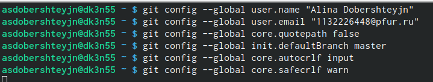{ #fig:001 width=70% }

3.Создание SSH-ключа
Сгенерировала пару ключей для последующей идентификации пользователя на сервере репозиториев (команда ssh-keygen -C).
Далее скопировала ключ с помощью команды cat ~/.ssh/id_rsa.pub | xclip
-sel clip. (рис. [-@fig:002])

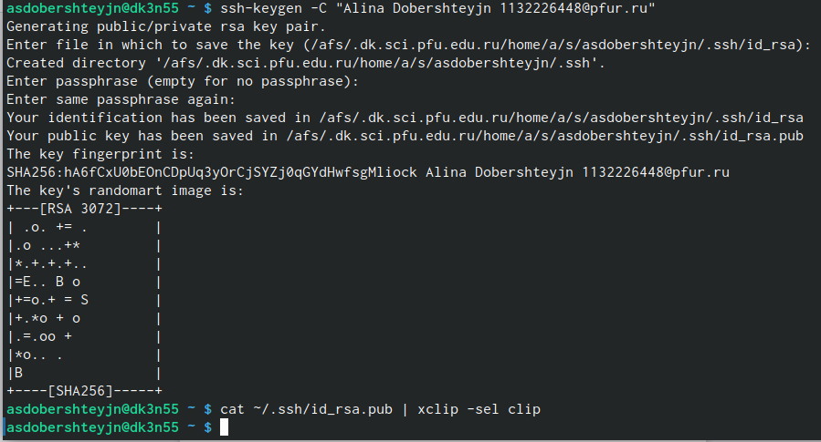{ #fig:002 width=70% }

Затем вставила ключ из буфера обмена в появившееся поле на сайте и
вписала имя ключа. (рис. [-@fig:003])

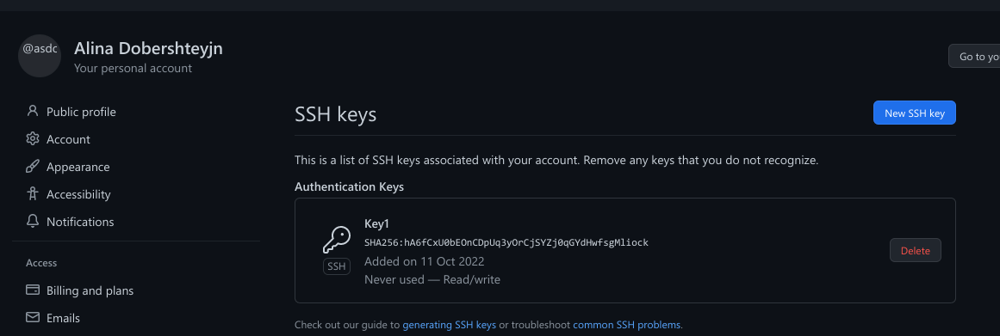{ #fig:003 width=70% }

4.Создание рабочего пространства и репозитория курса на основе
шаблона
В терминале создала каталог для предмета «Архитектура компьютера»
(команда mkdir -p ~/work/study/2022-2023/"Архитектура компьютера"). (рис. [-@fig:004])

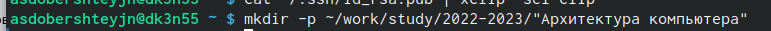{ #fig:004 width=70% }

5.Создание репозитория курса на основе шаблона
Перешла на станицу репозитория с шаблоном курса, выбрала «Use this
template».
В открывшемся окне задала имя репозитория «study_2022–2023_arh-pc» и создала репозиторий. (рис. [-@fig:005])

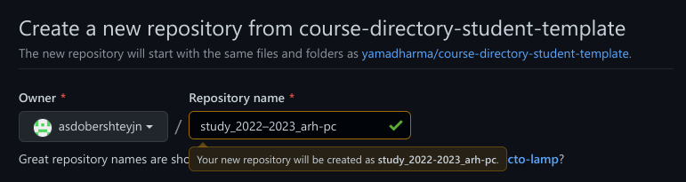{ #fig:005 width=70% }

В терминале перешла в каталог курса с помощью команды: cd~/work/study/2022-2023/"Архитектура компьютера" и клонировала созданный репозиторий. (рис. [-@fig:006])

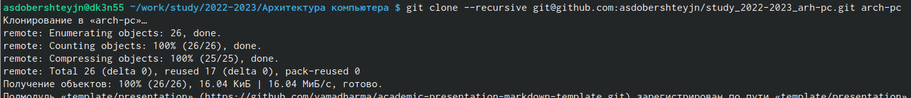{ #fig:006 width=70% }

6.Настройка каталога курса
Перешла в каталог курса (команда cd ~/work/study/2022-2023/"Архитектура компьютера"/arch-pc).
Удалила лишние файлы: rm package.json
Создала необходимые каталоги («echo arch-pc > COURSE» , «make»)
Отправила файлы на сервер («git add .», «git commit -am 'feat(main):
make course structure'», «git push»)(рис. [-@fig:007]), (рис. [-@fig:008])

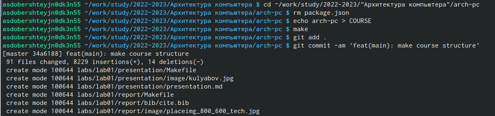{ #fig:007 width=70% }

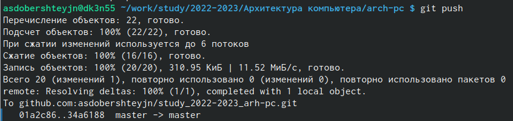{ #fig:008 width=70% }

Проверила правильность создания иерархии рабочего пространства в
локальном репозитории (рис. [-@fig:009]) и на странице github (рис. [-@fig:010]). 

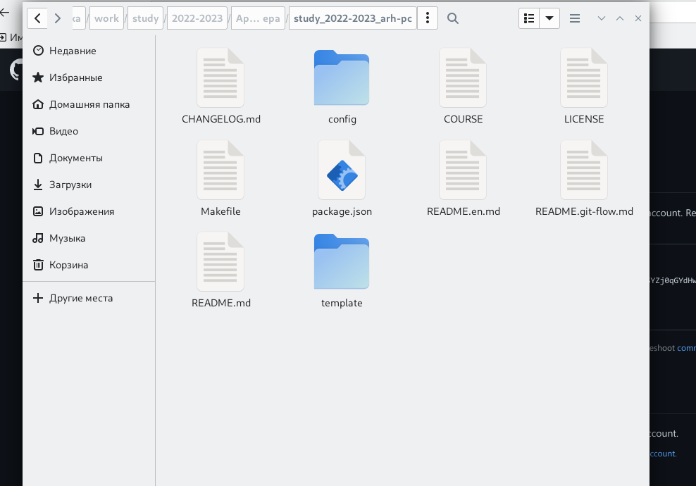{ #fig:009 width=70% } 

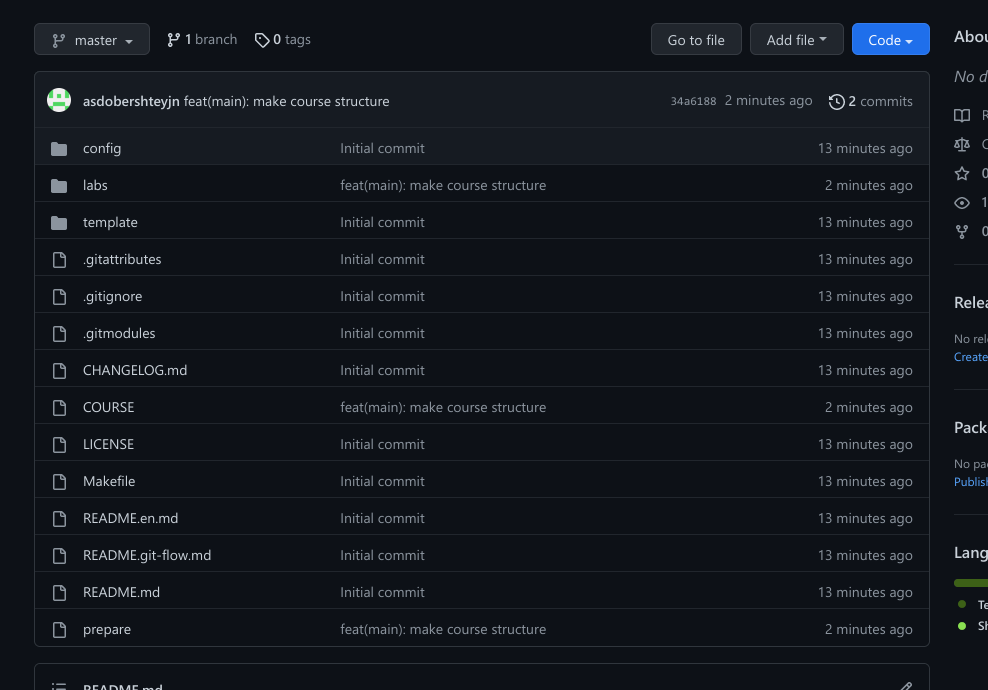{ #fig:010 width=70% }

Скопировала отчеты по выполнению предыдущих лабораторных работ в соответствующие каталоги созданного рабочего пространства изагрузила файлы на github. (рис. [-@fig:011]), (рис. [-@fig:012]). 

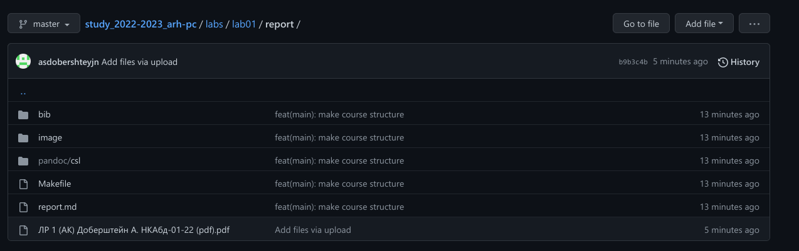{ #fig:011 width=70% } 

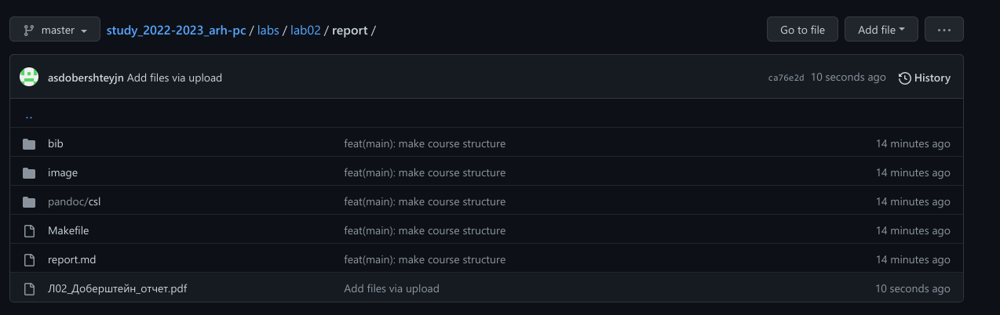{ #fig:012 width=70% } 

Затем создала отчет по выполнению лабораторной работы в соответствующем каталоге рабочего пространства (labs>lab03>report).

Ссылка на github:
asdobershteyjn/study_2022-2023_arh-pc (github.com)

# Выводы

Я изучила идеологию и применение средств контроля версий, а также
приобрела практические навыки по работе с системой git.
