---
## Front matter
title: "Отчет по лабораторной работе №5"
author: "Доберштейн Алина Сергеевна"

## Generic otions
lang: ru-RU
toc-title: "Содержание"

## Bibliography
bibliography: bib/cite.bib
csl: pandoc/csl/gost-r-7-0-5-2008-numeric.csl

## Pdf output format
toc: true # Table of contents
toc-depth: 2
lof: true # List of figures
lot: true # List of tables
fontsize: 12pt
linestretch: 1.5
papersize: a4
documentclass: scrreprt
## I18n polyglossia
polyglossia-lang:
  name: russian
  options:
	- spelling=modern
	- babelshorthands=true
polyglossia-otherlangs:
  name: english
## I18n babel
babel-lang: russian
babel-otherlangs: english
## Fonts
mainfont: PT Serif
romanfont: PT Serif
sansfont: PT Sans
monofont: PT Mono
mainfontoptions: Ligatures=TeX
romanfontoptions: Ligatures=TeX
sansfontoptions: Ligatures=TeX,Scale=MatchLowercase
monofontoptions: Scale=MatchLowercase,Scale=0.9
## Biblatex
biblatex: true
biblio-style: "gost-numeric"
biblatexoptions:
  - parentracker=true
  - backend=biber
  - hyperref=auto
  - language=auto
  - autolang=other*
  - citestyle=gost-numeric
## Pandoc-crossref LaTeX customization
figureTitle: "Рис."
tableTitle: "Таблица"
listingTitle: "Листинг"
lofTitle: "Список иллюстраций"
lotTitle: "Список таблиц"
lolTitle: "Листинги"
## Misc options
indent: true
header-includes:
  - \usepackage{indentfirst}
  - \usepackage{float} # keep figures where there are in the text
  - \floatplacement{figure}{H} # keep figures where there are in the text
---

# Цель работы

Освоение процедуры компиляции и сборки программ, написанных на ассемблере NASM.

# Выполнение лабораторной работы

###1.Программа Hello world!

Перешла в каталог lab05 для работы с программами на языке ассемблера NASM. 
Создала текстовый файл hello.asm с помощью команды touch.
Открыла созданный файл с помощью текстового редактора gedit(рис. [-@fig:001])

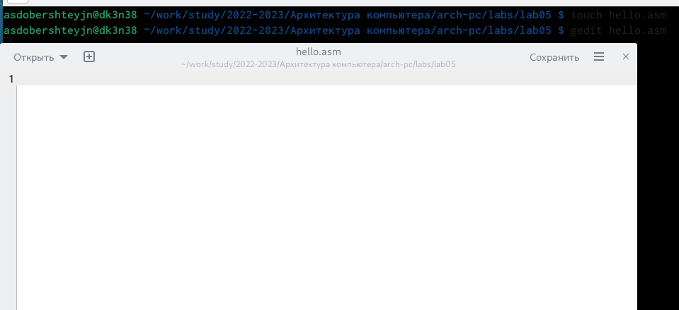{ #fig:001 width=70% }

В созданный файл ввела следующий текст: (рис. [-@fig:002])

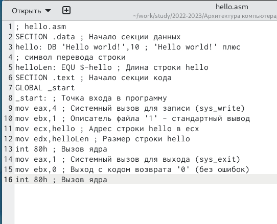{ #fig:002 width=70% }

###2.Транслятор NASM

Скомпилировала текст программы Hello world с помощью команды nasm -f elf hello.asm , объектный код записался в файл hello.o. (рис. [-@fig:003])

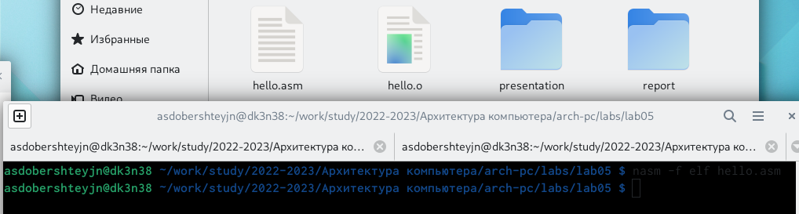{ #fig:003 width=70% }

С помощью команды ls проверила, что объектный файл был создан. Объектный файл имеет имя hello.o . (рис. [-@fig:004])

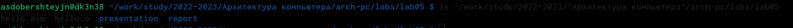{ #fig:004 width=70% }

### 3.Расщиренный синтаксис командной строки NASM

Ввела команду nasm -o obj.o -f elf -g -l list.lst hello.asm для компиляции исходного файла hello.asm в obj.o и создания файла листинга list.lst. (рис. [-@fig:005])

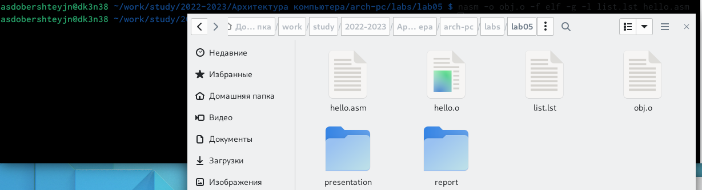{ #fig:005 width=70% }

Проверила создание этих файлов с помощью команды ls. (рис. [-@fig:006])

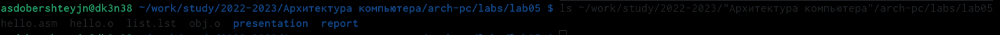{ #fig:006 width=70% }

### 4.Компоновщик LD

Ввела команду ld -m elf_i386 hello.o -o hello , чтобы получить исполняемую программу,
передать объектный файл на обработку компоновщику. (рис. [-@fig:007])

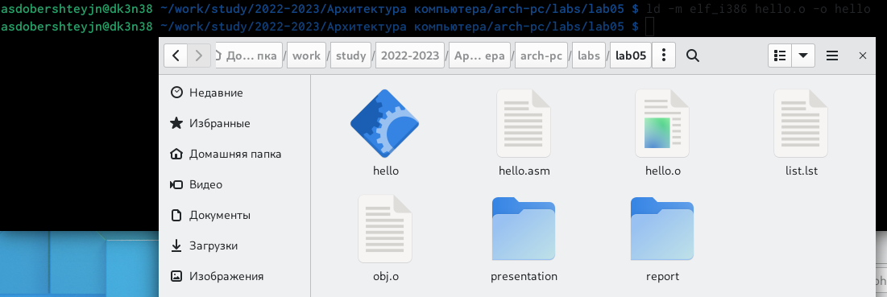{ #fig:007 width=70% }

С помощью команды ls проверила, что исполняемый файл hello был создан.(рис. [-@fig:008])

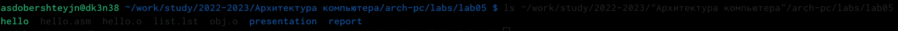{ #fig:008 width=70% }

Ввела команду ld -m elf_i386 obj.o -o main чтобы создать обътный файл с именем main. (рис. [-@fig:009])

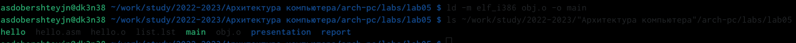{ #fig:009 width=70% }

### 5.Запуск исполняемого файла

Запустила исполняемый файл с помощью команды ./hello . (рис. [-@fig:010])

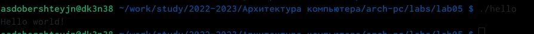{ #fig:010 width=70% }

### 6.Задание для самостоятельной работы

В каталоге lab05 с помощью команды cp создайла копию файла hello.asm с именем lab5.asm (рис. [-@fig:011])

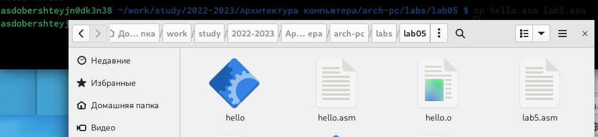{ #fig:011 width=70% }

С помощью текстового редактора gedit внесла изменения в текст программы в файле lab5.asm так, чтобы вместо Hello world! на экран выводилась строка с моими фамилией и именем. 
Далее оттранслировала полученный текст программы lab5.asm в объектный файл. Выполнила компоновку объектного файла и запустила получившийся исполняемый файл. (рис. [-@fig:012])

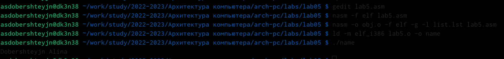{ #fig:012 width=70% }

Скопировала файлы hello.asm и lab5.asm в свой локальный репозиторийв каталог ~/work/study/2022-2023/"Архитектура компьютера"/arch-pc/labs/lab05/. Загрузила файлы на Github.

# Выводы

Я освоила процедуры компиляции и сборки программ, написанных на ассемблере NASM.

